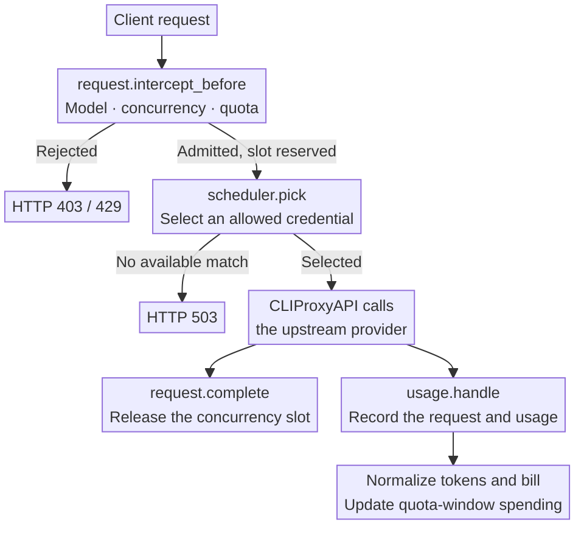
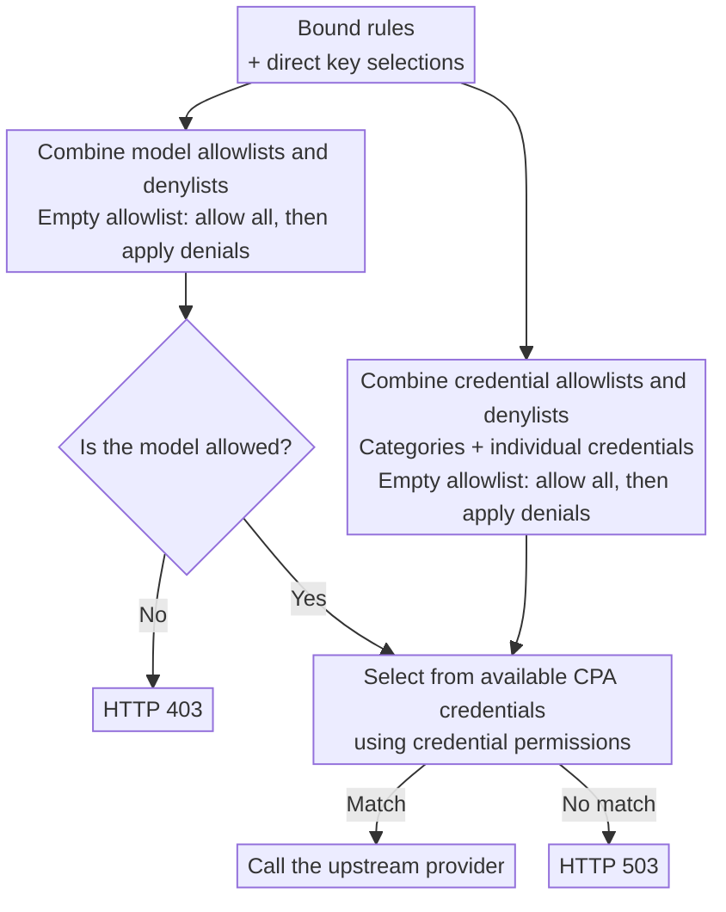

<div align="center">
  <h1>Codex Auth Manager</h1>
  <p><strong>Codex credential management, quotas, weights, concurrency, sticky sessions, scheduled tests and usage statistics for <a href="https://github.com/router-for-me/CLIProxyAPI">CLIProxyAPI</a>.</strong></p>
  <p>
    <a href="https://github.com/darvintang/cpa-plugin-key-billing/releases/latest"></a>
    <a href="https://github.com/darvintang/cpa-plugin-key-billing/actions/workflows/check.yml"></a>
    
    <a href="./LICENSE"></a>
  </p>
  <p><strong>English</strong> · <a href="./README.md">简体中文</a></p>
</div>


## Project origin

Codex Auth Manager is derived from [haowang02/cpa-plugin-key-billing](https://github.com/haowang02/cpa-plugin-key-billing) **version 1.3.8** (base commit [`78150bdc1`](https://github.com/haowang02/cpa-plugin-key-billing/commit/78150bdc10ce28afde4b3539f1be48ae2bead995)), originally authored by Hao Wang (haowang02). This repository is a derivative version maintained and extended by [Darvin (darvintang)](https://github.com/darvintang).

## Plus features

- Pricing and request-event pages show only `gpt-*` models; the auth-file page shows only Codex. Historical data is preserved.
- Credential call weights appear before enabled status and save automatically through the host auth-file API.
- Settings accept a per-credential ceiling of `0` (unlimited) or at least `4`. Ordinary requests use at most limit minus `2`; established sticky sessions may use the two reserved slots without exceeding the total ceiling. The plugin owns the in-memory bindings, with a configurable sliding TTL (default 5 minutes). CPA restart clears bindings; unavailable or disallowed credentials are replaced. Legacy ceilings `1–3` migrate to `4`. API key concurrency limits still apply.
- One test schedule applies to enabled Codex credentials: custom minute intervals or daily wall-clock times with an explicit time zone. Set a GPT model and prompt before enabling tests. Tests consume upstream quota and report results in plugin logs.
- Manual installers include `plugins/cpa-key-billing-plus-worker` (`.exe` on Windows). Store installations only install the library; scheduled tests additionally require the matching Release worker executable.
- Save task settings inside the task card and view the last execution and estimated next execution times. Upgrade both the library and worker for timing status.
- The external worker continues after the browser closes. Enable tasks and log in once to save the management session with AES-256-GCM in the `.settings.json.task-session/` directory beside the state file. CPA restarts automatically restore the worker without a browser. The random key and ciphertext are separate files; macOS/Linux use directory mode 0700 and file mode 0600. A process able to read both files can decrypt the session; restrict access to the state directory on Windows. Log in again after a management-key change or the first upgrade to enroll the session.
- Weight autosave requires the host auth-file fields endpoint; CLIProxyAPI `7.2.154` or newer is recommended.

## Features

- Set spending, token, and request quotas for each API key, with independent or shared reset schedules.
- Apply separate rates to requests that exceed a long-context input threshold.
- Limit concurrent requests per API key.
- Control access to models and upstream credentials with routing rules.
- Use model reference prices from [models.dev](https://models.dev/), with optional custom overrides.

## How it works

Before a request reaches an upstream provider, the plugin checks subscription quotas, concurrency, and routing. After execution, CLIProxyAPI supplies usage through `usage.handle`. The plugin uses that record to store the request event, calculate its cost, and update spending for the current quota window.



## Requirements

- CLIProxyAPI **7.2.143 or later**.
- A CLIProxyAPI build with plugin support. Builds labeled `no-plugin` cannot load this plugin.

## Installation

Add this repository as a plugin store source in the host configuration:

```yaml
plugins:
  store-sources:
    - https://raw.githubusercontent.com/darvintang/cpa-plugin-key-billing/main/registry.json
```

Keep `registry.json` aligned with the plugin version. Store installation requires a Release in this repository containing the platform ZIP archives and `checksums.txt`.

When migrating from the original plugin, back up the database, rename the configuration key and library to `cpa-key-billing-plus`, and explicitly point `state_file` to the original database. Existing credential route bindings remain valid.

Run the installer from your CLIProxyAPI directory.

On macOS or Linux:

```sh
curl -LsSf https://raw.githubusercontent.com/darvintang/cpa-plugin-key-billing/main/install.sh | sh
```

On Windows, stop CLIProxyAPI first, then run this in PowerShell:

```powershell
irm https://raw.githubusercontent.com/darvintang/cpa-plugin-key-billing/main/install.ps1 | iex
```

The installer places the plugin in `plugins/` under the current directory. Restart CLIProxyAPI after installing or upgrading.

For manual installation, download the archive for your platform from [Releases](https://github.com/darvintang/cpa-plugin-key-billing/releases/latest), then extract the library into CLIProxyAPI’s `plugins/` directory:

```text
plugins/cpa-key-billing-plus.so       # Linux
plugins/cpa-key-billing-plus.dylib    # macOS
plugins/cpa-key-billing-plus.dll      # Windows
```

## Configuration

Add the following to your CLIProxyAPI configuration:

```yaml
plugins:
  enabled: true
  dir: "plugins"
  configs:
    cpa-key-billing-plus:
      enabled: true
      debug: false # Include routing and reference-price matching in debug logs
      codex_fast_mode_billing: false # Charge 2.5× for Codex priority requests
      mask_api_key_view_emails: false # Mask email addresses in API key account views
      allow_api_key_quota_reset: false # Allow API key users to reset accessible Codex auth file quotas using upstream reset credits
      request_event_retention_days: 365 # Maximum request-event retention in days; older events are deleted automatically
      state_file: "plugins/cpa-key-billing-plus-state-v1.db"
```

> [!WARNING]
> Back up your data file before upgrading.
>
> - Databases created by v1.0.0 or later are migrated automatically.
> - JSON and SQLite files from v0.8.4 or earlier cannot be migrated. Point `state_file` to a new file instead.

Restart CLIProxyAPI and open **Codex Auth Manager** in the management panel. Review model pricing, create subscription plans, and bind the API keys whose quotas you want to enforce.

## Access

Administrators can open the plugin from the management panel or visit it directly:

```text
http(s)://<CLIProxyAPI address>/v0/resource/plugins/cpa-key-billing-plus/ui
```

API key holders can use their own key to view their subscription and usage:

```text
http(s)://<CLIProxyAPI address>/v0/resource/plugins/cpa-key-billing-plus/ui#account
```

## Billing and quotas

- Keys without a subscription plan still have their usage recorded, but have no subscription quota limit.
- A plan can contain multiple quota windows. Each window can limit spending in USD, tokens, requests, or any combination of the three.
- Usage is tracked separately for each key, even when keys share a plan. Independent cycles start when the first request is admitted. Shared cycles use the configured schedule for every bound key.
- A manual quota reset keeps shared reset times unchanged. Independent cycles restart when the next request is admitted.
- Custom model prices take precedence over models.dev reference prices. Requests are rejected if neither is available.
- Request events are retained for 365 days.

## Routing rules

Bind routing rules on the API key page, or set model and credential permissions directly on a key. Each selection cycles through three states: unselected, allowed (check mark), and denied (cross).

A credential-category selection covers all credentials in that category, including credentials added later. You can deny individual credentials within an allowed category.

The plugin combines all bound rules with the key’s direct selections. Model and credential permissions are evaluated separately: allowlists are combined, denylists are combined, and denials take precedence. An empty allowlist permits everything that is not explicitly denied.



## Rejection responses

| Condition | HTTP status | `type` | `code` |
| --- | --- | --- | --- |
| Concurrency limit reached | `429` | `rate_limit_error` | `rate_limit_exceeded` |
| Subscription quota exhausted | `429` | `rate_limit_error` | `rate_limit_exceeded` |
| Model access denied | `403` | `permission_error` | `insufficient_quota` |
| No available credential matches the routing rules | `503` | `server_error` | `internal_server_error` |
| A bound routing rule is missing or invalid | `503` | `server_error` | `routing_configuration_error` |

## Copyright and license

This project remains licensed under the [MIT License](./LICENSE), preserving the upstream copyright notice and the full license terms:

- Original project: Copyright (c) 2026 Hao Wang
- Additions and modifications in the Plus version: Copyright (c) 2026 Darvin (darvintang)

The additional copyright notice covers only original contributions to this version and does not replace the upstream author's copyright in the original code.

## Acknowledgments

- [Hao Wang (haowang02)](https://github.com/haowang02) and the contributors to [cpa-plugin-key-billing](https://github.com/haowang02/cpa-plugin-key-billing), for developing and open-sourcing the original plugin on which Plus is based.
- [LINUX DO](https://linux.do/) community.
