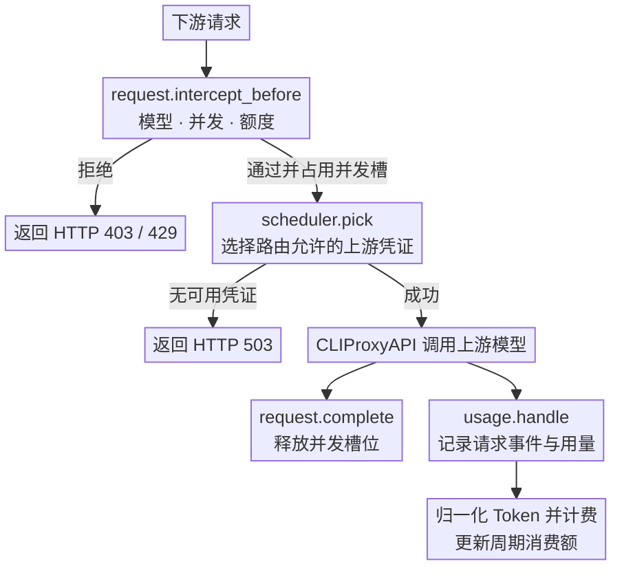
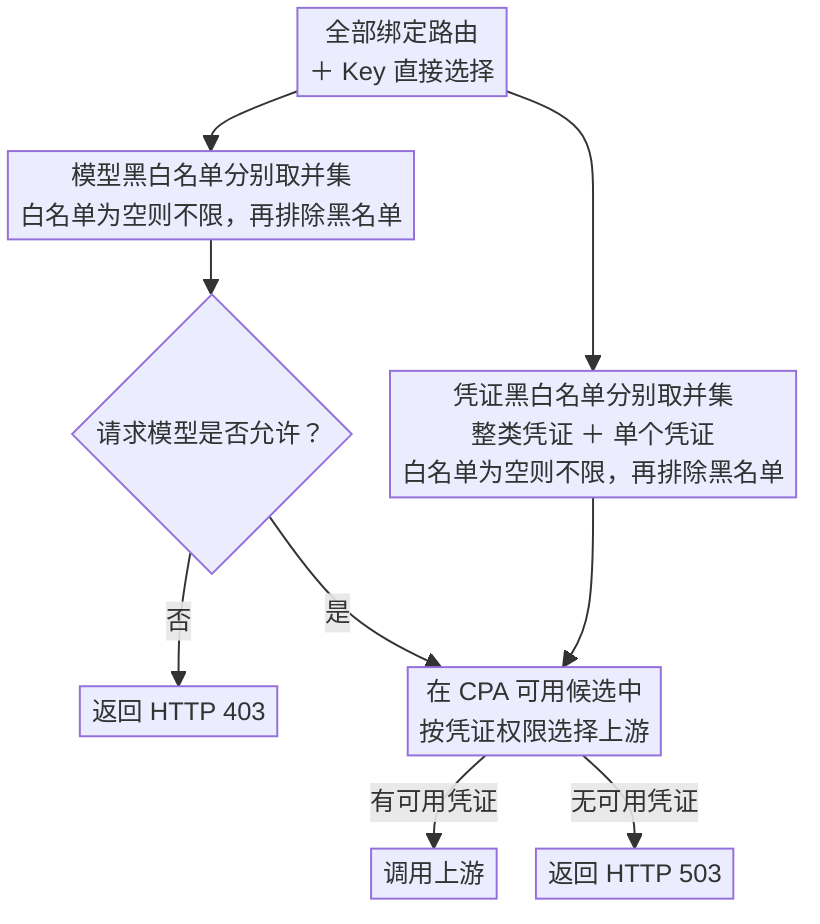

<div align="center">
  <h1>Codex Auth Manager</h1>
  <p><strong><a href="https://github.com/router-for-me/CLIProxyAPI">CLIProxyAPI</a> Codex 认证凭证管理插件，提供凭证额度、调用权重、并发与粘性会话、定时测试管理，并统计 Token 用量、请求次数与费用。</strong></p>
  <p>
    <a href="https://github.com/darvintang/cpa-plugin-key-billing/releases/latest"></a>
    <a href="https://github.com/darvintang/cpa-plugin-key-billing/actions/workflows/check.yml"></a>
    
    <a href="./LICENSE"></a>
  </p>
  <p><a href="./README.en.md">English</a> · <strong>简体中文</strong></p>
</div>


## 项目来源

Codex Auth Manager 基于 [haowang02/cpa-plugin-key-billing](https://github.com/haowang02/cpa-plugin-key-billing) 的 **1.3.8 版本**（基准提交 [`78150bdc1`](https://github.com/haowang02/cpa-plugin-key-billing/commit/78150bdc10ce28afde4b3539f1be48ae2bead995)）开发，由 [Darvin（darvintang）](https://github.com/darvintang) 在原项目基础上维护和扩展。本仓库为衍生版本，上游原作者为 Hao Wang（haowang02）。

## Plus 功能

- 模型定价和请求事件页面仅显示 `gpt-*` 模型；认证文件页面仅显示 Codex。筛选不删除历史数据。
- 认证文件卡片在启用状态前提供调用权重输入，输入完成后自动保存到宿主认证文件；悬停权重文字可查看说明，并显示当前并发数和统一并发上限。
- 设置页统一配置每个凭证的最大并发数：只能为 `0`（不限）或至少 `4`。普通请求最多占用上限减 `2`，TTL 内命中原凭证的粘性会话可使用预留的 `2` 个槽，总并发仍不超过上限。插件自行维护内存绑定，TTL 默认 5 分钟且可配置，成功放行刷新 TTL，CPA 重启清空缓存；原凭证失效或不再符合路由规则时重新选择。旧配置 `1–3` 自动迁移为 `4`。API Key 自身的并发限制仍然生效。
- 条件任务统一作用于启用的 Codex 凭证，支持自填分钟间隔、每日指定时间和时区；需要填写 GPT 模型与测试提示词后开启。测试会消耗上游额度，执行结果记录在插件日志中。
- 定时执行程序 `plugins/cpa-key-billing-plus-worker`（Windows 为 `.exe`）随人工安装脚本安装；商店只安装动态库，定时任务还需安装对应 Release 的 worker 文件并授予执行权限。
- 条件任务卡片内保存设置，并显示上次执行与预计下次执行时间；更新时间功能需同步升级动态库与 worker。
- 定时程序在独立进程中运行，关闭浏览器后继续执行。开启任务并登录一次管理页面后，管理会话使用 AES-256-GCM 加密保存在状态文件旁的 `.settings.json.task-session/` 目录；CPA 重启会自动恢复任务，无需打开浏览器。随机密钥与密文分开保存，macOS/Linux 上目录权限为 0700、文件为 0600；同时读取两者的进程仍可解密，Windows 应限制状态目录的用户访问权限。管理密钥变更后需重新登录更新会话。首次升级也需登录一次完成保存。
- 权重自动保存需要支持 `/v0/management/auth-files/fields` 的宿主，建议 CLIProxyAPI `7.2.154` 或更新版本。

## 功能特性

- 支持金额、Token、请求三种额度，可按 API Key 独立计时或按订阅计划统一周期重置
- 支持按输入 Token 阈值切换长上下文**阶梯计价**
- 支持按 API Key 设置**最大并发请求数**
- 支持为每个 API Key 绑定**路由规则**，限制模型访问范围和上游凭证
- 可从 [models.dev](https://models.dev/) 获取模型参考价

## 工作原理

插件会在请求到达上游前检查订阅额度、并发和路由。上游调用结束后，CLIProxyAPI 通过 `usage.handle` 提供用量。插件据此记录请求事件、计算费用并更新周期消费额。



## 环境要求

- CLIProxyAPI `7.2.143` 或更高版本，建议使用最新版本
- 使用支持插件的 CLIProxyAPI 构建，不要使用 no-plugin 版本

## 安装

在宿主配置中添加本仓库的插件商店源：

```yaml
plugins:
  store-sources:
    - https://raw.githubusercontent.com/darvintang/cpa-plugin-key-billing/main/registry.json
```

`registry.json` 与插件版本保持一致；商店安装需要本仓库先发布包含对应平台 ZIP 和 `checksums.txt` 的 Release。

从原插件迁移时，请备份数据库，将配置键与动态库改为 `cpa-key-billing-plus`，并让 `state_file` 显式指向原数据库。已有凭证路由绑定继续有效。

### 商店安装

CPA 管理面板（CPAMC 或 CPAMP）插件商店搜索 `cpa-key-billing-plus`。

### 人工安装

在 CLIProxyAPI 根目录运行。macOS 和 Linux 使用：

```sh
curl -LsSf https://raw.githubusercontent.com/darvintang/cpa-plugin-key-billing/main/install.sh | sh
```

Windows 请先停止 CLIProxyAPI，再在 PowerShell 中运行：

```powershell
irm https://raw.githubusercontent.com/darvintang/cpa-plugin-key-billing/main/install.ps1 | iex
```

安装脚本会将插件安装到当前目录的 `plugins/`。安装或升级完成后需要重启 CLIProxyAPI。

在 CLIProxyAPI 配置文件中加入：

```yaml
plugins:
  enabled: true
  dir: "plugins"
  configs:
    cpa-key-billing-plus:
      enabled: true
      debug: false # 是否记录 debug 日志，例如路由日志、匹配参考价日志
      codex_fast_mode_billing: false # 开启后，Codex 的 priority 请求按 2.5 倍计费
      mask_api_key_view_emails: false # 对 API Key 查询页面返回的邮箱进行掩码脱敏
      allow_api_key_quota_reset: false # 允许 API Key 用户重置可访问的 Codex 和 Claude 认证文件额度，消耗上游重置次数
      request_event_retention_days: 365 # 请求事件最大保留天数，超过后自动删除
      state_file: "plugins/cpa-key-billing-plus-state-v1.db"
```

> [!WARNING]
> 升级前请备份数据文件。
>
> - v1.0.0 至最新版本的数据库文件支持自动迁移。
> - v0.8.4 及更早版本的 JSON 或 SQLite 数据文件不支持迁移，请将 `state_file` 指向新文件。

重启 CLIProxyAPI 后，在管理中心打开「Codex Auth Manager」。确认模型定价后，创建订阅计划并绑定需要限制的 API Key。

## 页面访问

管理员可以从 CLIProxyAPI 管理中心的「Codex Auth Manager」菜单进入，也可以直接打开：

```text
http(s)://<CLIProxyAPI 地址>/v0/resource/plugins/cpa-key-billing-plus/ui
```

普通用户使用自己的 API Key 查询订阅额度和用量时，直接打开：

```text
http(s)://<CLIProxyAPI 地址>/v0/resource/plugins/cpa-key-billing-plus/ui#account
```

## 计费与订阅规则

- 未绑定订阅计划的 API Key 只统计用量，不限制额度。
- 订阅计划可设置多个自定义额度窗口，每个窗口可单独或组合限制金额、Token、请求数。
- 每个 API Key 独立记账。独立周期从首次放行开始；统一周期可为各窗口指定下次开始时间，所有绑定 Key 按固定时间重置。
- 手动重置额度时，统一周期的重置时间保持不变；独立周期在下一次放行时重新开始。
- 自定义价优先于 models.dev 参考价，两者都没有时拒绝新请求。
- 请求事件保留最近 365 天。

## 路由规则

在 API Key 页面绑定路由规则，也可直接选择模型、整类凭证或单个凭证。点击模型或凭证的选框，可在未选择、白名单（勾号）、黑名单（叉号）之间切换。整类凭证包含该类别后续新增的凭证，也可用黑名单排除其中的单个凭证。模型与凭证分别合并所有绑定规则和直接选择：白名单取并集，黑名单取并集，黑名单优先。白名单为空时允许全部，再排除黑名单。



## 拦截请求的响应

| 场景 | 状态码 | `type` | `code` |
| --- | --- | --- | --- |
| API Key 并发已满 | `429` | `rate_limit_error` | `rate_limit_exceeded` |
| 订阅额度用尽 | `429` | `rate_limit_error` | `rate_limit_exceeded` |
| 模型无权访问 | `403` | `permission_error` | `insufficient_quota` |
| 没有符合规则且可用的凭证 | `503` | `server_error` | `internal_server_error` |
| 已绑定的路由规则不存在或损坏 | `503` | `server_error` | `routing_configuration_error` |

## 版权与许可

本项目继续使用 [MIT License](./LICENSE)，保留上游版权及完整许可声明：

- 原始项目：Copyright (c) 2026 Hao Wang
- Plus 版本新增与修改部分：Copyright (c) 2026 Darvin (darvintang)

新增版权声明仅适用于本版本的原创贡献，不替代上游作者对原始代码的版权。

## 致谢

- [Hao Wang（haowang02）](https://github.com/haowang02) 及 [cpa-plugin-key-billing](https://github.com/haowang02/cpa-plugin-key-billing) 的贡献者：感谢原始插件的开发与开源，为 Plus 版本提供了基础。
- [LINUX DO](https://linux.do/) - 新的理想型社区
